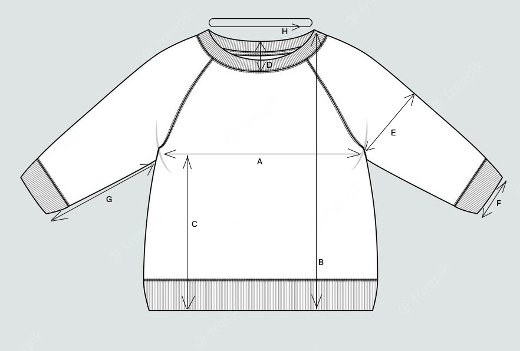

# Sweater project

In this project I am making a calculator for cardigan, knitted from top in the circle.

Input data will contain:

1. Sample measurments:
- width in cm or inches,
- height in cm or inches,
- width in stiches,
- height in rows.

2. Desired sweater measurments:

- A - bust half,
- B - length total,
- C - length bottom to armpit,
- D - neckopening height.
- E - under arm half,
- F - sleave wrist half,
- G - sleave wrist to armpit,
- H - neck around.

Based on sample and desired sweater measurments, this calculator should tell row by row instructions about:
- how many stiches are required to start,
- where to place markers on the knitting,
- where to make increases and decreases,
- where to disconnect arms from the whole part,
- what amount of rows is needed.

## Output, that you will receive after running the code with our sweater parameters will look like:

Start by casting on 90 stitches.

Place markers after stitch: (17, 35, 55, 73). They will be in the middle of your reglan lines.
____________________________________________________
____________________________________________________
Working on the neck opening:
________________________________________________________
(Row 1): knit front half 16 + yarn over 1 + reglan line 2 + yarn over 1 + sleeve 16 + yarn over 1 + reglan line 2 + yarn over 1 + back 18 +  yarn over 1 + reglan line 2 + yarn over 1 + knit 3 -> Turn

(Row 2): knit 4 + reglan line 2 + back 20 + reglan line 2 + knit 4 -> Turn

(Row 3): knit 4 + yarn over 1 + reglan line 2 + yarn over 1 + back 20 + yarn over 1 + reglan line 2 + yarn over 1 + knit 7 -> Turn

(Row 4): knit 8 + reglan line 2 + back 22 + reglan line 2 + knit 8 -> Turn

(Row 5): knit 8 + yarn over 1 + reglan line 2 + yarn over 1 + back 22 + yarn over 1 + reglan line 2 + yarn over 1 + knit 12 -> Turn

(Row 6): knit 13 + reglan line 2 + back 24 + reglan line 2 + knit 13 -> Turn

(Row 7): knit 13 + yarn over 1 + reglan line 2 + yarn over 1 + back 24 + yarn over 1 + reglan line 2 + yarn over 1 + knit 18 -> Turn

(Row 8): knit 19 + reglan line 2 + back 26 + reglan line 2 + knit 19 -> Turn

(Row 9): knit 19 + yarn over 1 + reglan line 2 + yarn over 1 + back 26 + yarn over 1 + reglan line 2 + yarn over 1 + knit sleeve 20 + yarn over 1 + reglan line 2 + yarn over 1 + knit 5 -> Turn

(Row 10): knit 6 + reglan line 2 + sleeve 22 + reglan line 2 + back 28 + reglan line 2 + sleeve 22 + reglan line 2 + knit 6 -> Turn

(Row 11): knit 6 + yarn over 1 + reglan line 2 + yarn over 1 + sleeve 22 + yarn over 1 + reglan line 2 + yarn over 1 + back 28 + yarn over 1 + reglan line 2 + yarn over 1 + sleave 22 + yarn over 1 + reglan line 2 + yarn over 1 + knit 13 -> Turn

(Row 12): knit 14 + reglan line 2 + sleeve 24 + reglan line 2 + back 30 + reglan line 2 + sleeve 24 + reglan line 2 + knit 14 -> Turn

(Row 13): knit 14 + reglan line 2 + sleave 24 + reglan line 2 + back 30 + reglan line 2 + sleave 24 + reglan line 2 + knit 17
_______________________________________________________________________________
You should reach end of stitches line.

Now your sweater will be worked in the circle! In the next Row attach last stitch to the first stitch!

You have total of 120 stiches at (Row 13).
____________________________________________________
____________________________________________________
Working from the neck to armpits:
________________________________________________________
Knit in the circle until (Row 46) (included) and increase 1 stich around every reglan line in Row: (14, 16, 19, 21, 24, 26, 29, 31, 34, 36, 39, 41, 44), (total increase in 1 circle = 8 stitches).

You have total of 224 stitches at (Row 46).
____________________________________________________
____________________________________________________
Disconnecting arms from bust:
________________________________________________________
(Row 47): Knit until Marker-1, set main yarn aside.

Close 52 stitches of the arm using differen yarn color(including 1 reglan stitches at the beginning and end of the sleeve).
Return to main yarn.

Turn it around the needle loosely to make loops for future 8 stitches.

Knit back part until Marker-3, set main yarn aside.

Close 52 stitches of the arm using different yarn color(including 1 reglan stitches at the beginning and end of the sleeve). Return to main yarn.

Turn it around the needle loosely to make loops for future 8 stitches.

Knit until the final Marker.
________________________________________________________
You have total of 136 stitches at (Row 47).
________________________________________________________
________________________________________________________
Working down from the bust:
________________________________________________________
(Row 48): Knit in the circle, knit 8 stitches under armpit from the yarn, that you turned around the needle in previous row, continue knitting and repeat under next armpit, knit until end of the row.
________________________________________________________
Knit bust part in the circle without increases until (Row 107).

You can make last 4-8 rows ribbed with 1x1 rib or 2x2 rib.
________________________________________________________
________________________________________________________
Working down the sleeve (repeat for each sleeve):
________________________________________________________
Knit the sleeve in the circle until (Row 117) (included) and decrease 1 stich around every reglan line in Row: (48, 59, 71, 83, 94, 106), (total decrease in 1 circle = 2 stitches).

You have total of 40 stitches at (Row 117).

You can make last 4-8 rows ribbed with 1x1 rib or 2x2 rib.

